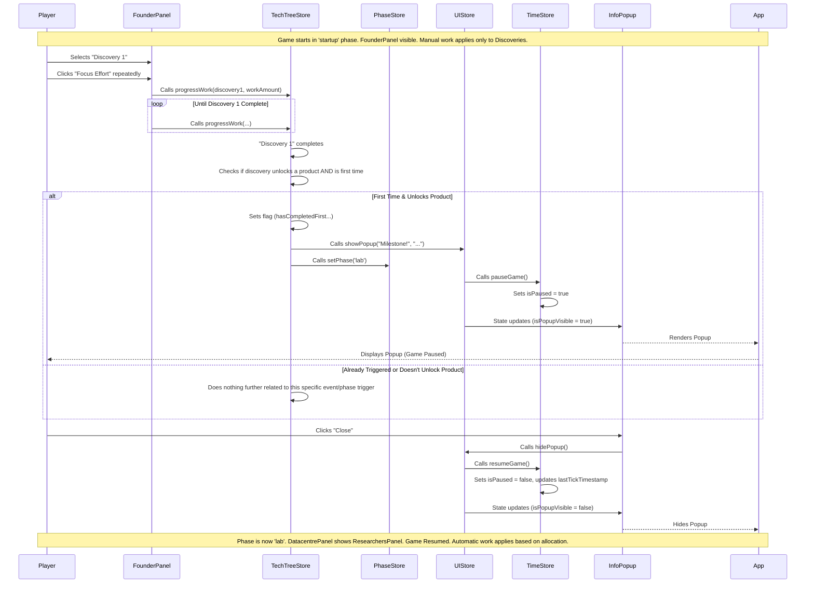

# Documentation: Events and Phases System ("March of Mind")

## Introduction

This document describes the Event Detection, Popup, and Phase Management systems implemented in "March of Mind". These systems work together to create distinct stages of gameplay, triggered by specific player achievements, and communicated via informational popups. The initial implementation focuses on transitioning from a manual 'startup' phase to an automated 'lab' phase.

## Core Components

1. **Phase Management (`src/stores/phase.ts`)**: Controls the overall stage of the game.
2. **Event Detection (Decentralized)**: Logic within specific stores (e.g., `techTreeStore`) detects when significant milestones occur.
3. **Popup System (`src/stores/ui.ts`, `src/components/InfoPopup.vue`)**: Displays informational messages to the player and pauses the game temporarily.
4. **Time Store Enhancements (`src/stores/time.ts`)**: Provides `pauseGame` and `resumeGame` functions used by the popup system.

## Phase Management System

* **Store**: `usePhaseStore` located in `src/stores/phase.ts`.
* **State**:
  * `currentPhase: Ref<GamePhase>`: Holds the current active phase (e.g., `'startup'`, `'lab'`). `GamePhase` is a type defined in `src/types/index.ts`.
* **Actions**:
  * `setPhase(newPhase: GamePhase)`: Transitions the game to the specified phase. It includes logging and prevents redundant transitions to the same phase.
  * `initialize()`: Resets the phase to the default starting phase (`'startup'`).
* **Usage**:
  * Check the current phase: Access `phaseStore.currentPhase` (reactive).
  * Transition phase: Call `phaseStore.setPhase('newPhaseName')`.
  * Conditional Rendering: Use `v-if="phaseStore.currentPhase === 'phaseName'"` in Vue components to show/hide UI elements based on the phase (e.g., swapping `FounderPanel` for `ResearchersPanel`).

## Event Detection System

* **Concept**: Identifies when specific, significant game milestones are reached (e.g., completing the first discovery that enables product development, reaching a certain resource threshold).
* **Current Implementation**: Event detection is currently *decentralized*. The logic resides within the Pinia store action most closely related to the event.
  * **Example (First Product-Unlocking Discovery Completion)**: The check occurs inside the `completeWork` action within `src/stores/techTree.ts`. It verifies if the completed tech is a `discovery`, if this is the first such discovery completion (`hasCompletedFirstProductUnlockingDiscovery` flag), and if that discovery's `completionMakesAvailable` list includes at least one item of type `product`.
* **Triggering Actions**: When an event condition is met, the detection logic typically:
  1. Sets a flag (e.g., `hasCompletedFirstProductUnlockingDiscovery`) to prevent the event from firing repeatedly.
  2. Calls `uiStore.showPopup()` to inform the player.
  3. Calls `phaseStore.setPhase()` if the event triggers a phase transition.

## Popup System

* **Store**: `useUiStore` located in `src/stores/ui.ts`.
* **State**:
  * `isPopupVisible: Ref<boolean>`: Controls the visibility of the generic info popup.
  * `popupTitle: Ref<string | null>`: Title displayed in the popup.
  * `popupMessage: Ref<string | null>`: Message body displayed in the popup.
* **Actions**:
  * `showPopup(title: string, message: string)`: Makes the popup visible, sets its content, and calls `timeStore.pauseGame()`.
  * `hidePopup()`: Hides the popup, clears its content, and calls `timeStore.resumeGame()`.
* **Component**: `src/components/InfoPopup.vue` renders the popup based on the `uiStore` state and provides a "Close" button that calls `hidePopup()`.
* **Integration**: `<InfoPopup />` is included globally in `src/App.vue`.
* **Game Pause**: The popup system automatically pauses the game via `useTimeStore` when shown and resumes it when hidden, ensuring the player doesn't miss anything while the popup is active. (Note: The Quiz modal uses the same pause/resume mechanism).

## System Interaction Flow (Startup -> Lab Example)

This flow illustrates the transition triggered by completing the first discovery that unlocks a product (e.g., completing "Discovery 1" which makes "Product 1" available).



## Adding New Events and Phases

### Adding a New Phase (e.g., 'Expansion')

1. **Define Type**: Add the phase name to the `GamePhase` type in `src/types/index.ts` (e.g., `export type GamePhase = 'startup' | 'lab' | 'expansion';`).
2. **Trigger**: Identify the event that triggers the transition to 'expansion' (e.g., completing 'Research Project Alpha').
3. **Implement Trigger Logic**: In the relevant store action (e.g., `techTreeStore.completeWork`), add a check for the event condition. If met, call `phaseStore.setPhase('expansion')` and potentially `uiStore.showPopup(...)`.
4. **Conditional Rendering**: Update components (like `App.vue`, `DatacentrePanel.vue`, etc.) using `v-if="phaseStore.currentPhase === 'expansion'"` or `v-else-if` to render UI specific to the new phase.
5. **Modify Logic**: Adjust core game logic (like work application in `timeStore.performTick` or resource generation) if the new phase has different rules.

### Adding a New Event (e.g., "Funding Secured" Popup at $100,000 Savings)

1. **Identify Trigger**: The trigger is `resourcesStore.savingsAmount` reaching 100,000.
2. **Implement Detection**: The best place is likely within the `resourcesStore.addSavings` action.

```typescript
// Inside resourcesStore actions:
let fundingSecuredEventTriggered = false; // Add flag at store scope

function addSavings(amount: number) {
  const oldSavings = savingsAmount.value;
  savingsAmount.value += amount;
  
  // Check for event AFTER adding savings
  if (!fundingSecuredEventTriggered && oldSavings < 100000 && savingsAmount.value >= 100000) {
     fundingSecuredEventTriggered = true;
     const uiStore = useUiStore(); // Get instance
     uiStore.showPopup("Funding Secured!", "You've reached $100,000! New opportunities await.");
     // This event doesn't trigger a phase change in this example.
     console.log("EVENT: Funding Secured triggered.");
  }
}

// Remember to reset the flag in initialize()
function initialize() {
    // ... reset other state
    savingsAmount.value = 0;
    fundingSecuredEventTriggered = false;
}
```

3. **No Phase Change**: This event only shows a popup.

## Best Practices

- **Centralize Phase State**: Always use `usePhaseStore` to manage and check the current game phase. Avoid storing phase information redundantly.
- **Decentralize Event Detection**: Keep event detection logic close to the source of the event (e.g., resource events in `resourcesStore`, tech completion events in `techTreeStore`).
- **Use Popups for Significance**: Reserve informational popups for significant milestones or phase transitions to avoid interrupting the player too often.
- **Clear Phase Logic**: Use `v-if`/`v-else-if`/`v-else` in templates for phase-specific UI. Avoid complex conditional logic scattered within component `<script setup>`.
- **Pause/Resume Discipline**: Ensure any modal or interruption uses `timeStore.pauseGame()` and `timeStore.resumeGame()` correctly via the `uiStore` actions.
- **Idempotency**: Ensure event triggers (especially those setting flags) are idempotent – firing the event logic multiple times should have the same effect as firing it once.

## Common Mistakes to Avoid

- **Forgetting Pause/Resume**: Implementing modals/popups without pausing the game.
- **Incorrect DeltaTime on Resume**: Not handling `lastTickTimestamp` correctly in `resumeGame` causing time jumps (the current implementation does handle this).
- **Scattered Phase Checks**: Checking `phaseStore.currentPhase` in many different places for minor logic variations instead of using conditional rendering or centralizing phase-specific logic adjustments.
- **Triggering Events Repeatedly**: Forgetting to add flags (like `hasCompletedFirstProductUnlockingDiscovery`) for events that should only occur once.
- **Phase Transitions Without Popups**: Abruptly changing UI or rules without informing the player via a popup.

## Known Limitations

- **Decentralized Event Logic**: May become harder to manage as many more events are added. A future refactor could introduce a more centralized event bus system if needed.
- **Simple Popup System**: The current `InfoPopup` is basic (single "Close" button, simple text).
- **Single Linear Phase Progression**: The current `PhaseStore` is simple. Complex branching or returning to previous phases would require enhancements.