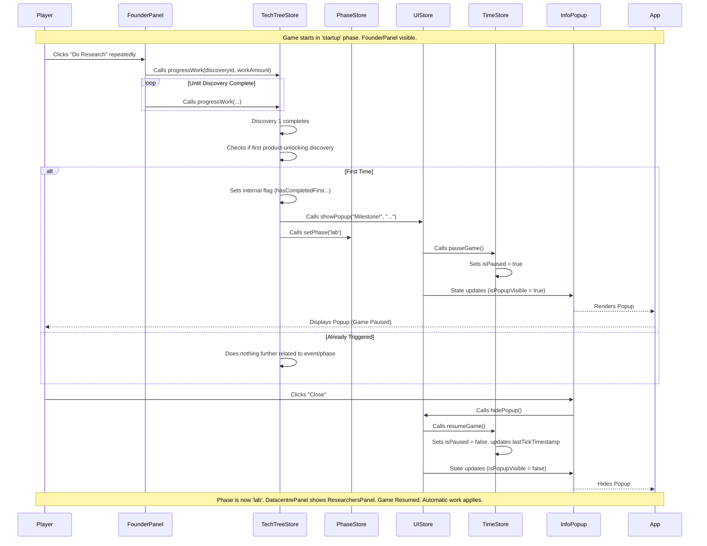

# Documentation: Events and Phases System ("March of Mind")

## Introduction

This document describes the Event Detection, Popup, and Phase Management systems implemented in "March of Mind". These systems work together to create distinct stages of gameplay, triggered by specific player achievements, and communicated via informational popups.

## Core Components

1. **Phase Management (`src/stores/phase.ts`)**: Controls the overall stage of the game.
2. **Event Detection (Decentralized)**: Logic within specific stores (e.g., `techTreeStore`) detects when significant milestones occur.
3. **Popup System (`src/stores/ui.ts`, `src/components/InfoPopup.vue`)**: Displays informational messages to the player and pauses the game temporarily.
4. **Time Store Enhancements (`src/stores/time.ts`)**: Provides `pauseGame` and `resumeGame` functions used by the popup system.

## Phase Management System

* **Store**: `usePhaseStore` located in `src/stores/phase.ts`.
* **State**:
  * `currentPhase: Ref<GamePhase>`: Holds the current active phase (e.g., `'startup'`, `'lab'`). `GamePhase` is a type defined in `src/types/index.ts`.
* **Actions**:
  * `setPhase(newPhase: GamePhase)`: Transitions the game to the specified phase. It includes logging and prevents redundant transitions to the same phase.
  * `initialize()`: Resets the phase to the default starting phase (`'startup'`).
* **Usage**:
  * Check the current phase: Access `phaseStore.currentPhase` (reactive).
  * Transition phase: Call `phaseStore.setPhase('newPhaseName')`.
  * Conditional Rendering: Use `v-if="phaseStore.currentPhase === 'phaseName'"` in Vue components to show/hide UI elements based on the phase (e.g., swapping `FounderPanel` for `ResearchersPanel`).

## Event Detection System

* **Concept**: Identifies when specific, significant game milestones are reached (e.g., completing the first product-unlocking discovery, reaching a certain resource threshold).
* **Current Implementation**: Event detection is currently *decentralized*. The logic resides within the Pinia store action most closely related to the event.
  * **Example (First Product-Unlocking Discovery)**: The check occurs inside the `completeWork` action within `src/stores/techTree.ts`. It checks if the completed tech is a discovery, if it unlocks a product, and if the `hasCompletedFirstProductUnlockingDiscovery` flag is false.
* **Triggering Actions**: When an event condition is met, the detection logic typically:
  1. Sets a flag (if necessary) to prevent the event from firing repeatedly.
  2. Calls `uiStore.showPopup()` to inform the player.
  3. Calls `phaseStore.setPhase()` if the event triggers a phase transition.

## Popup System

* **Store**: `useUiStore` located in `src/stores/ui.ts`.
* **State**:
  * `isPopupVisible: Ref<boolean>`: Controls the visibility of the generic info popup.
  * `popupTitle: Ref<string | null>`: Title displayed in the popup.
  * `popupMessage: Ref<string | null>`: Message body displayed in the popup.
* **Actions**:
  * `showPopup(title: string, message: string)`: Makes the popup visible, sets its content, and calls `timeStore.pauseGame()`.
  * `hidePopup()`: Hides the popup, clears its content, and calls `timeStore.resumeGame()`.
* **Component**: `src/components/InfoPopup.vue` renders the popup based on the `uiStore` state and provides a "Close" button that calls `hidePopup()`.
* **Integration**: `<InfoPopup />` is included globally in `src/App.vue`.
* **Game Pause**: The popup system automatically pauses the game via `useTimeStore` when shown and resumes it when hidden, ensuring the player doesn't miss anything while the popup is active. (Note: The Quiz modal uses the same pause/resume mechanism).

## System Interaction Flow (Startup -> Lab Example)



## Adding New Events and Phases

### Adding a New Phase (e.g., 'Expansion'):

1. **Define Type**: Add the phase name to the `GamePhase` type in `src/types/index.ts` (e.g., `export type GamePhase = 'startup' | 'lab' | 'expansion';`).
2. **Trigger**: Identify the event that triggers the transition to 'expansion' (e.g., completing 'Product X').
3. **Implement Trigger Logic**: In the relevant store action (e.g., `techTreeStore.completeWork`), add a check for the event condition. If met, call `phaseStore.setPhase('expansion')` and potentially `uiStore.showPopup(...)`.
4. **Conditional Rendering**: Update components (like `App.vue`, `DatacentrePanel.vue`, etc.) using `v-if="phaseStore.currentPhase === 'expansion'"` or `v-else-if` to render UI specific to the new phase.
5. **Modify Logic**: Adjust core game logic (like work application in `timeStore.performTick` or resource generation) if the new phase has different rules.

### Adding a New Event (e.g., "Funding Secured" Popup at $100,000 Savings):

1. **Identify Trigger**: The trigger is `resourcesStore.savingsAmount` reaching 100,000.
2. **Implement Detection**: The best place might be within the `resourcesStore.addSavings` action.

```typescript
// Inside resourcesStore actions:
let fundingSecuredEventTriggered = false; // Add this flag at store level

function addSavings(amount) {
  const oldSavings = savingsAmount.value;
  savingsAmount.value += amount;
  // Check for event AFTER adding savings
  if (!fundingSecuredEventTriggered && oldSavings < 100000 && savingsAmount.value >= 100000) {
     fundingSecuredEventTriggered = true;
     const uiStore = useUiStore(); // Get instance
     uiStore.showPopup("Funding Secured!", "You've reached $100,000! New opportunities await.");
     // This event might not trigger a phase change, just a popup.
     console.log("EVENT: Funding Secured triggered.");
  }
}

// Remember to reset the flag in initialize()
function initialize() {
    // ... reset other state
    fundingSecuredEventTriggered = false;
}
```

3. **No Phase Change**: This event might only show a popup without changing the phase.

## Best Practices

* **Centralize Phase State**: Always use `usePhaseStore` to manage and check the current game phase. Avoid storing phase information redundantly in other stores or components.
* **Decentralize Event Detection**: Keep event detection logic close to the source of the event (e.g., resource events in `resourcesStore`, tech completion events in `techTreeStore`).
* **Use Popups for Significance**: Reserve informational popups for significant milestones or phase transitions to avoid interrupting the player too often.
* **Clear Phase Logic**: Use `v-if`/`v-else-if`/`v-else` in templates for phase-specific UI. Avoid complex conditional logic scattered within component `<script setup>`.
* **Pause/Resume Discipline**: Ensure any modal or interruption that requires the player's full attention uses `timeStore.pauseGame()` and `timeStore.resumeGame()` correctly via the uiStore actions (`showPopup`/`hidePopup`, `showQuizModal`/`hideQuizModal`).
* **Idempotency**: Ensure event triggers (especially those setting flags) are idempotent – firing the event logic multiple times should have the same effect as firing it once.

## Common Mistakes to Avoid

* **Forgetting Pause/Resume**: Implementing a modal/popup without pausing the game can lead to players missing game progression.
* **Incorrect DeltaTime on Resume**: Forgetting to reset `lastTickTimestamp` in `resumeGame` can cause a large time jump and resource surge immediately after resuming. (The current implementation handles this).
* **Scattered Phase Checks**: Checking `phaseStore.currentPhase` in many different places for minor logic variations. Try to contain phase-specific behavior within larger conditional blocks or components.
* **Triggering Events Repeatedly**: Forgetting to add flags (like `hasCompletedFirstProductUnlockingDiscovery`) means events might trigger on every subsequent similar action.
* **Phase Transitions Without Popups**: Abruptly changing the UI or game rules without informing the player via a popup can be confusing.

## Known Limitations

* **Decentralized Event Logic**: As more events are added, managing the detection logic scattered across different stores might become less maintainable. A future refactor could introduce a more centralized event bus/emitter system if complexity warrants it.
* **Simple Popup System**: The current `InfoPopup` is basic. It doesn't support complex formatting, images, or multiple buttons (other than "Close").
* **Single Linear Phase Progression**: The current `PhaseStore` assumes a mostly linear progression (startup -> lab). More complex branching or returning to previous phases would require enhancements.
